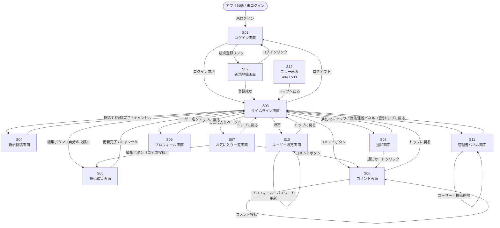

# 画面遷移図

> S03〜S11 は未ログイン時に自動的に S01（ログイン画面）へリダイレクトされます。
> S11（管理者パネル）は管理者権限のないユーザーがアクセスすると 403 エラー（S12）になります。

## 画面遷移一覧

| 起点画面 | 操作 | 遷移先 |
|---|---|---|
| アプリ起動（未ログイン） | — | S01 |
| S01 ログイン | ログイン成功 | S03 |
| S01 ログイン | 新規登録リンク | S02 |
| S02 新規登録 | 登録成功 | S03 |
| S02 新規登録 | ログインリンク | S01 |
| S03 タイムライン | 投稿するボタン | S04 |
| S03 タイムライン | 編集ボタン（自分の投稿） | S05 |
| S03 タイムライン | コメントボタン | S06 |
| S03 タイムライン | お気に入りページへ | S07 |
| S03 タイムライン | 通知ページへ | S08 |
| S03 タイムライン | ユーザー名クリック | S09 |
| S03 タイムライン | 設定 | S10 |
| S03 タイムライン | 管理者パネル（管理者のみ） | S11 |
| S03 タイムライン | ログアウト | S01 |
| S04 新規投稿 | 投稿完了 / キャンセル | S03 |
| S05 投稿編集 | 更新完了 / キャンセル | S03 |
| S06 コメント | コメント投稿 | S06（同画面） |
| S06 コメント | トップに戻る | S03 |
| S07 お気に入り一覧 | コメントボタン | S06 |
| S07 お気に入り一覧 | 編集ボタン（自分の投稿） | S05 |
| S07 お気に入り一覧 | トップに戻る | S03 |
| S08 通知 | 通知カードクリック | S06 |
| S08 通知 | トップに戻る | S03 |
| S09 プロフィール | トップに戻る | S03 |
| S10 ユーザー設定 | プロフィール・パスワード更新 | S10（同画面） |
| S10 ユーザー設定 | トップに戻る | S03 |
| S11 管理者パネル | ユーザー・投稿削除 | S11（同画面） |
| S11 管理者パネル | トップに戻る | S03 |
| S12 エラー | トップへ戻る | S03 |
| S03〜S11（未ログイン時） | 保護ページへのアクセス | S01 |
