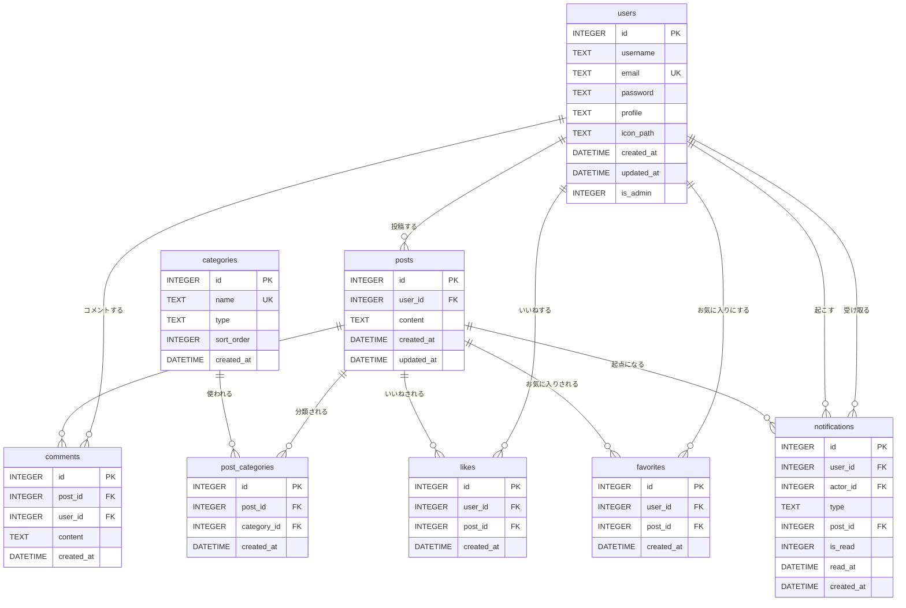

# ER図

## テーブル間の関係まとめ

| リレーション | 種別 | 説明 |
|---|---|---|
| users → posts | 1対多 | 1ユーザーが複数投稿を持つ |
| users → comments | 1対多 | 1ユーザーが複数コメントを持つ |
| posts → comments | 1対多 | 1投稿に複数コメントが付く |
| users ↔ posts（likes） | 多対多 | likes テーブルを中間テーブルとして使用 |
| users ↔ posts（favorites） | 多対多 | favorites テーブルを中間テーブルとして使用 |
| posts ↔ categories | 多対多 | post_categories テーブルを中間テーブルとして使用 |
| users（user_id） → notifications | 1対多 | 通知の受信者 |
| users（actor_id） → notifications | 1対多 | 通知を発生させたユーザー |
| posts → notifications | 1対多 | 通知の起点となった投稿 |

> **notifications の actor_id について**
> `user_id`（通知受信者）と `actor_id`（いいね・コメント・お気に入りをした人）は
> 両方 users テーブルを参照する外部キーです。自分の投稿への操作は通知を生成しません。
